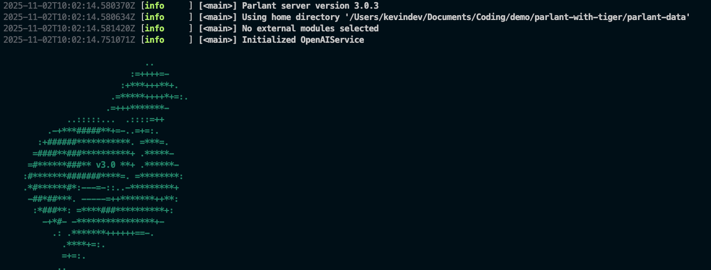

# Build an AI Agent using Parlant and Timescale Postgres


This repo is built for [Agentic Postgres Challenge](https://dev.to/devteam/join-the-agentic-postgres-challenge-with-tiger-data-3000-in-prizes-17ip?ahoy_click=true&t=9rharIlTFFhqrIYP0TaNzWNEg4ITIrwE&s=lxNtF7nM7OhVPZBNLBFPY4Z7Yo0bySZj3AgUVFnk46E&u=https%253A%252F%252Fdev.to%252Fdevteam%252Fjoin-the-agentic-postgres-challenge-with-tiger-data-3000-in-prizes-17ip).

## Get Start

### Prerequisite

The following items are required to setup this application

- **OpenAI Api Key:** `Parlant` uses `gpt-4o` as its reasoning model by default. For more information, refer to [this link](https://platform.openai.com/docs/api-reference/introduction).
- **Jina Api Key:** Using `Jina` for documents processing, such as embedding and rerank. [Sign up](https://jina.ai/) an account, you'll get free credits on calling `Jina` API endpoints.
- **Tiger Data Account:** Follow the provied instructions to create an account on `Tiger Cloud`. For more information, refer to [this guide](https://docs.tigerdata.com/getting-started/latest/services/#create-your-timescale-account).

### Run the demo locally

1. **Set up the environment variables:**

   Create a `.env` file in the root directory of the project by copying the example file:

   ```bash
   cp .env.example .env
   ```

   Then, edit the `.env` file to add your API keys and database URL:

   ```
   OPENAI_API_KEY=<your_openai_api_key_here>
   JINA_API_KEY=<your_jina_api_key_here>
   TIMESCALE_DATABASE_URL=<your_timescale_database_url_here>
   TIMESCALE_DATABASE_PASSWORD=<your_timescale_database_password_here>
   ```

2. **Install the dependencies:**

   Install the required Python libraries using pip:

   ```bash
   pip install -r requirements.txt
   ```

3. **Table creation:** execute the following SQL statement to create a table on `Tiger Cloud` console

```sql
-- Enable extensions
CREATE EXTENSION IF NOT EXISTS vector;

-- Create table for our news articles
CREATE TABLE documents (
    id TEXT PRIMARY KEY,
    title TEXT,
    content TEXT,
    embedding VECTOR(1024) -- jina-embeddings-v3 dimensions
);

-- Create indexes for performance
CREATE INDEX ON documents USING GIN (to_tsvector('english', content));
CREATE INDEX ON documents USING ivfflat (embedding vector_cosine_ops);
```

4. Load the data into the table `documents`

   Execute the `docs.py` file to load the data

   ```bash
   python docs.py
   ```

5. **Run the application:**

   Execute the `agent.py` file to start the Parlant agent:

   ```bash
   python agent.py
   ```

   You should see the agent starting up and ready to receive messages.

   
